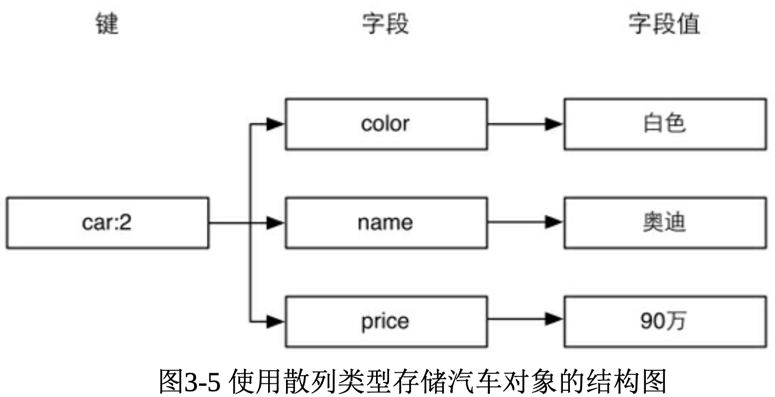
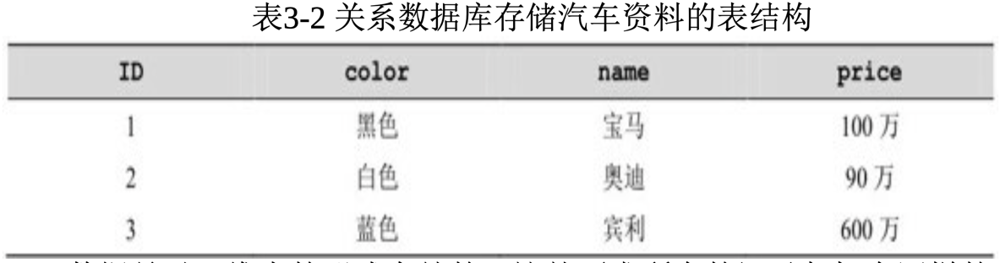
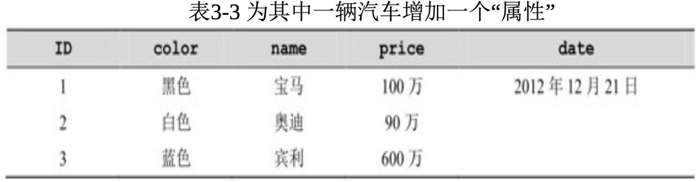
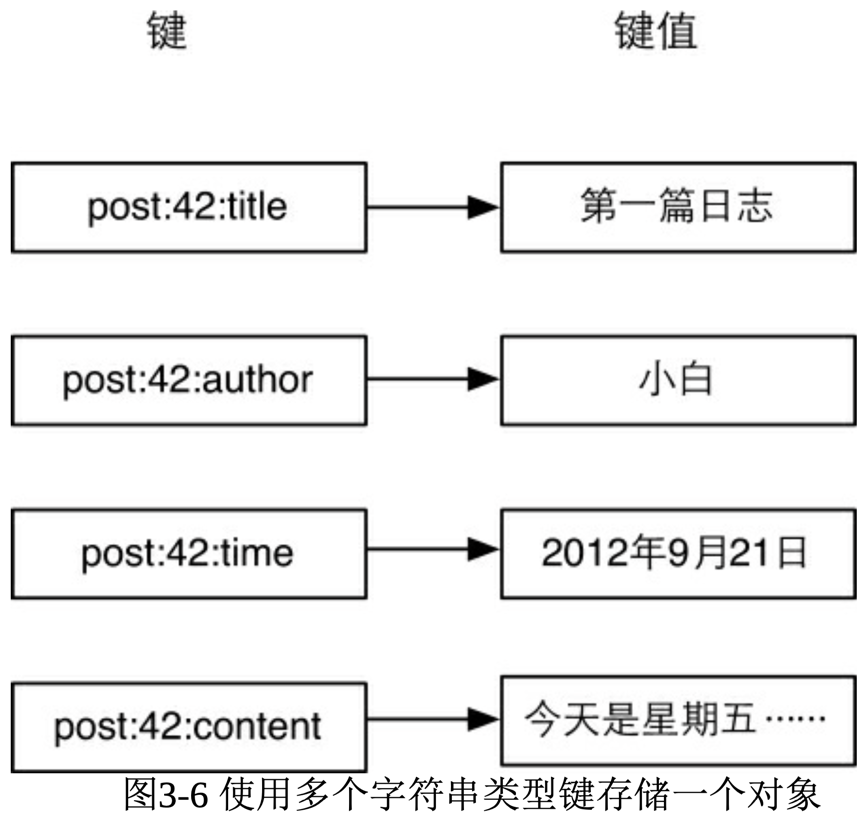
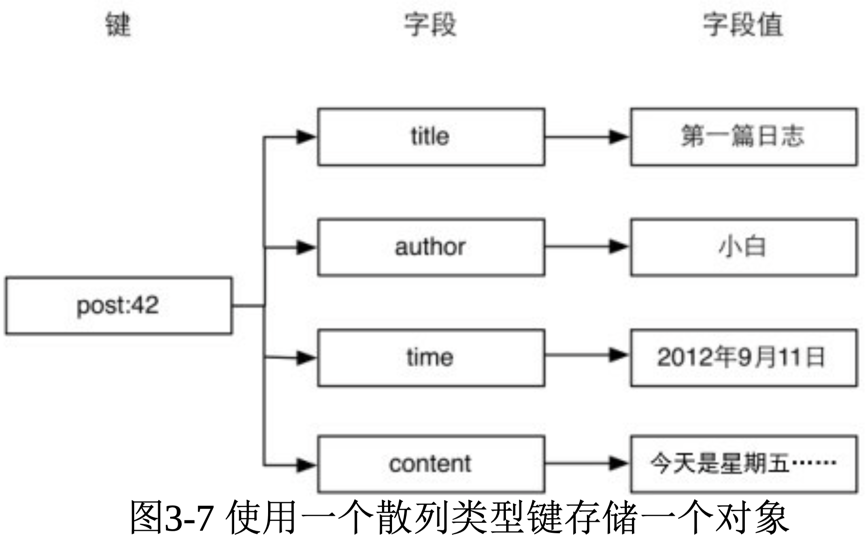
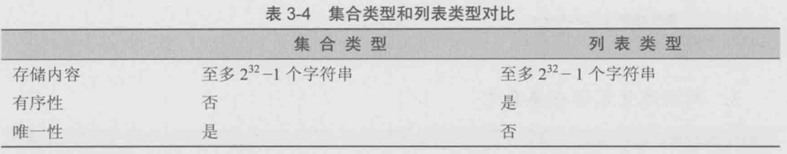
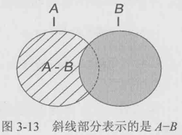
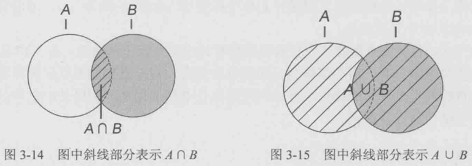
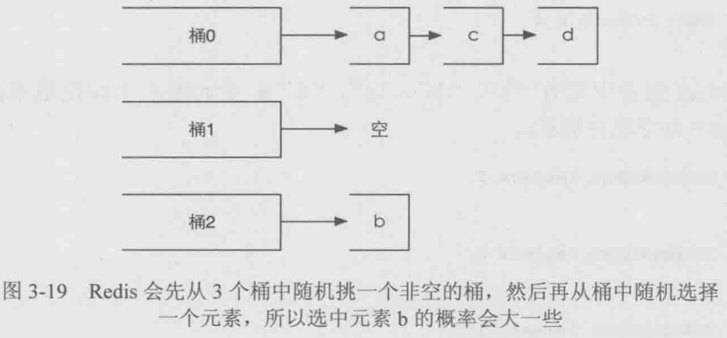

[TOC]


# 散列类型(hash类型)


## 介绍

我们现在已经知道 Redis 是采用字典结构以键值对的形式存储数据 的，而散列类型(hash)的键值也是一种字典结构，其存储了字段 (field)和字段值的映射，但字段值只能是字符串，不支持其他数据类 型，换句话说，散列类型不能嵌套其他的数据类型。一个散列类型键可以包含至多 2^32−1
个字段。

>提示：除了散列类型，Redis 的其他数据类型同样不支持数据类型嵌 套。比如集合类型的每个元素都只能是字符串，不能是另一个集合或散 列表等。

散列类型适合存储对象:使用对象类别和 ID 构成键名，使用字段 表示对象的属性，而字段值则存储属性值。例如要存储ID为2的汽车对 象，可以分别使用名为color、name和price的3个字段来存储该辆汽车的 颜色、名称和价格。存储结构如图3-5所示。



回想在关系数据库中如果要存储汽车对象，存储结构如表3-2所
示。



数据是以二维表的形式存储的，这就要求所有的记录都拥有同样的 属性，无法单独为某条记录增减属性。如果想为 ID 为 1 的汽车增加生 产日期属性，就需要把数据表更改为如表3-3所示的结构。



对于ID为2和3的两条记录而言date字段是冗余的。可想而知当不同 的记录需要不同的属性时，表的字段数量会越来越多以至于难以维护。 而且当使用ORM[8] 将关系数据库中的对象实体映射成程序中的实体时， 修改表的结构往往意味着要中断服务(重启网站程序)。为了防止这些 问题，在关系数据库中存储这种半结构化数据还需要额外的表才行。

而 Redis 的散列类型则不存在这个问题。虽然我们在图 3-5 中描述 了汽车对象的存储结构，但是这个结构只是人为的约定，Redis并不要 求每个键都依据此结构存储，我们完全可以自由地为任何键增减字段而 不影响其他键。


## 命令

1. 赋值与取值

```
HSET key field value

HGET key field

HMSET key field value [field value ...]

HMGET key field [field ...]

HGETALL key 
```

HSET命令用来给字段赋值，而HGET命令用来获得字段的值。用法
如下:


```
redis> HSET car price 500 
(integer) 1

redis> HSET car name BMW 
(integer) 1

redis> HGET car name
"BMW"
```

HSET 命令的方便之处在于不区分插入和更新操作，这意味着修改
数据时不用事先判断字段是否存在来决定要执行的是插入操作 (update)还是更新操作(insert)。当执行的是插入操作时(即之前字 段不存在)HSET命令会返回1，当执行的是更新操作时(即之前字段已 经存在)HSET命令会返回0。更进一步，当键本身不存在时，HSET命 令还会自动建立它。

>提示 在Redis中每个键都属于一个明确的数据类型，如通过 HSET 命令建立的键是散列类型，通过SET命令建立的键是字符串类型等等。 使用一种数据类型的命令操作另一种数据类型的键会提示错误:"ERR Operation against a key holding the wrong kind of value"[9] 。

当需要同时设置多个字段的值时，可以使用HMSET命令。例如， 下面两条语句

```
HSET key field1 value1

HSET key field2 value2 可以用HMSET命令改写成

HMSET key field1 value1 field2 value2
```

相应地，HMGET命令可以同时获得多个字段的值:
```
redis> HMGET car price name
1) "500"
2) "BMW" 
```

如果想获取键中所有字段和字段值却不知道键中有哪些字段时(如
3.3.1节介绍的存储汽车对象的例子，每个对象拥有的属性都未必相同) 应该使用HGETALL命令。如:
```
redis> HGETALL car 
1) "price"
2) "500"
3) "name"
4) "BMW"
``` 


返回的结果是字段和字段值组成的列表，不是很直观，好在很多语 言的 Redis 客户端会将 HGETALL 的返回结果封装成编程语言中的对 象，处理起来就非常方便了。例如，在Node.js中:
``` javascript
redis.hgetall("car", function (error, car) {
    //hgetall 方法的返回的值被封装成了 JavaScript的对象 
    console.log(car.price);
    console.log(car.name);
});
```

2. 判断字段是否存在

```
HEXISTS key field 
```
HEXISTS命令用来判断一个字段是否存在。如果存在则返回1，否
则返回0(如果键不存在也会返回0)。 
```
redis> HEXISTS car model
(integer) 0
redis> HSET car model C200 (integer) 1
redis> HEXISTS car model
(integer) 1
```

3. 当字段不存在时赋值

```
HSETNX key field value
```

HSETNX[10] 命令与HSET命令类似，区别在于如果字段已经存在，
HSETNX命令将不执行任何操作。其实现可以表示为如下伪代码: 
```
def hsetnx($key, $field, $value)
    $isExists = HEXISTS $key, $field if $isExists is 0
    HSET $key, $field, $value return 1
    else
    return 0
```

只不过HSETNX命令是原子操作，不用担心竞态条件。 

4. 增加数字
```
HINCRBY key field increment 
```

上一节的命令拾遗部分介绍了字符串类型的命令INCRBY，
HINCRBY命令与之类似，可以使字段值增加指定的整数。散列类型没 有 HINCR 命令，但是可以通过 HINCRBY key field 1来实现。

HINCRBY命令的示例如下:
```
redis> HINCRBY person score 60
(integer) 60 
```

之前person键不存在，HINCRBY命令会自动建立该键并默认score
字段在执行命令前的值为“0”。命令的返回值是增值后的字段值。 

5. 删除字段
```
HDEL key field [field ...]
```

HDEL命令可以删除一个或多个字段，返回值是被删除的字段个 数:

```
redis> HDEL car price (integer) 1
redis> HDEL car price (integer) 0
```

## 实践

1. 存储文章数据

3.2.3节介绍了可以将文章对象序列化后使用一个字符串类型键存 储，可是这种方法无法提供对单个字段的原子读写操作支持，从而产生 竞态条件，如两个客户端同时获得并反序列化某个文章的数据，然后分 别修改不同的属性后存入，显然后存入的数据会覆盖之前的数据，最后 只会有一个属性被修改。另外如小白所说，即使只需要文章标题，程序 也不得不将包括文章内容在内的所有文章数据取出并反序列化，比较消 耗资源。

除此之外，还有一种方法是组合使用多个字符串类型键来存储一篇 文章的数据，如图3-6所示。



使用这种方法的好处在于无论获取还是修改文章数据，都可以只对
某一属性进行操作，十分方便。而本章介绍的散列类型则更适合此场 景，使用散列类型的存储结构如图3-7所示。



从图3-7可以看出使用散列类型存储文章数据比图3-6所示的方法看 起来更加直观，也更容易维护(比如可以使用 HGETALL 命令获得一个 对象的所有字段，删除一个对象时只需要删除一个键)，另外存储同样 的数据散列类型往往比字符串类型更加节约空间，具体的细节会在4.6 节中介绍。

2. 存储文章缩略名

使用过WordPress的读者可能会知道发布文章时一般需要指定一个 缩略名(slug)来构成该篇文章的网址的一部分，缩略名必须符合网址 规范且最好可以与文章标题含义相似，如“This Is A Great Post!”的缩略 名可以为“this-is-a-great-post”。每个文章的缩略名必须是唯一的，所以 在发布文章时程序需要验证用户输入的缩略名是否存在，同时也需要通 过缩略名获得文章的ID。

我们可以使用一个散列类型的键slug.to.id来存储文章缩略名和ID之
间的映射关系。其中字段用来记录缩略名，字段值用来记录缩略名对应 的ID。这样就可以使用HEXISTS命令来判断缩略名是否存在，使用 HGET命令来获得缩略名对应的文章ID了。

现在发布文章可以修改成如下代码:

```
$postID = INCR posts:count
# 判断用户输入的 slug 是否可用，如果可用则记录 
$isSlugAvailable = HSETNX slug.to.id, $slug, $postID 

if $isSlugAvailable is 0
    # slug 已经用过了，需要提示用户更换 slug, 
    # 这里为了演示方便直接退出。
    exit

HMSET post:$postID, title, $title, content, $content, slug, $slug,...
```


这段代码使<font color=yellow>用了HSETNX命令原子地实现了HEXISTS和HSET两个 命令以避免竞态条件。</font>当用户访问文章时，我们从网址中得到文章的缩 略名，并查询slug.to.id键来获取文章ID:

```
$postID = HGET slug.to.id, $slug 
if not $postID
    print 文章不存在
    exit
$post = HGETALL post:$postID
print 文章标题:$post.title 
```

需要注意的是如果要修改文章的缩略名一定不能忘了修改 slug.to.id
键对应的字段。如要修改ID为42的文章的缩略名为newSlug变量的值:
```
# 判断新的 slug 是否可用，如果可用则记录 
$isSlugAvailable = HSETNX slug.to.id, $newSlug, 42 

if $isSlugAvailable is 0
    exit

# 获得旧的缩略名
$oldSlug = HGET post:42, slug 

# 设置新的缩略名
HSET post:42, slug, $newSlug 

# 删除旧的缩略名
HDEL slug.to.id, $oldSlug
```

## 命令拾遗

1. 只获取字段名或字段值
```
HKEYS key
HVALS key 
```
有时仅仅需要获取键中所有字段的名字而不需要字段值，那么可以
使用HKEYS命令，就像这样: 
```
redis> HKEYS car
1) "name"
2) "model" 
```
HVALS命令与HKEYS命令相对应，HVALS命令用来获得键中所有 字段值，例如:
```   
redis> HVALS car 
1) "BMW"
2) "C200" 
```
2.获得字段数量 
```
HLEN key 
```
例如:
```
redis> HLEN car 
(integer) 2
```


# 列表类型(list类型)


正当小白踌躇满志地写着文章列表页的代码时，一个很重要的问题
阻碍了他的开发，于是他请来了宋老师为他讲解。

原来小白是使用如下流程获得文章列表的:

- 读取 posts:count键获得博客中最大的文章ID;
- 根据这个 ID 来计算当前列表页面中需要展示的文章 ID 列表(小白规定博客每页只显示10篇文章，按照ID的倒序排列)，如第n页的文 章ID范围是从"最大的文章ID - (n - 1) * 10"到"max(最大的文章 ID - n * 10 + 1, 1)";
- 对每个ID 使用 HMGET命令来获得文章数据。 

对应的伪代码如下:
```
# 每页显示 10 篇文章
$postsPerPage = 10

# 获得最后发表的文章 ID
$lastPostID = GET posts:count

# $currentPage 存储的是当前页码，第一页时$currentPage的值为1，依此类推
$start = $lastPostID - ($currentPage - 1) * $postsPerPage
$end = max($lastPostID - $currentPage * $postsPerPage + 1, 1) 

# 遍历文章 ID 获取数据
for $i = $start down to $end
    # 获取文章的标题和作者并打印出来 
    post = HMGET post:$i, title, author 
    print $post[0] # 文章标题
    print $post[1] # 文章作者
```

可是这种方式要求用户不能删除文章以保证 ID 连续，否则小白就 必须在程序中使用EXISTS命令判断某个ID的文章是否存在，如果不存 在则跳过。由于每删除一篇文章都会影响后面的页码分布，为了保证每 页的文章列表都能正好显示10篇文章，不论是第几页，都不得不从最大 的文章ID开始遍历来获得当前页面应该显示哪些文章。

小白摇了摇头，心想:“真是个灾难!”然后看向宋老师，试探地问 道:“我想到了KEYS命令，可不可以使用 KEYS命令获得所有 以“post:”开头的键，然后再根据键名分页呢?”

宋老师回答道:“确实可行，不过KEYS命令需要遍历数据库中的所 有键，出于性能考虑一般很少在生产环境中使用这个命令。至于你提到 的问题，可以使用 Redis 的列表类型来解决。”

## 介绍

列表类型(list)可以存储一个有序的字符串列表，常用的操作是 向列表两端添加元素，或者获得列表的某一个片段。

列表类型内部是使用双向链表(double linked list)实现的，所以向 列表两端添加元素的时间复杂度为O(1)，获取越接近两端的元素速度就 越快。这意味着即使是一个有几千万个元素的列表，获取头部或尾部的 10条记录也是极快的(和从只有20个元素的列表中获取头部或尾部的10 条记录的速度是一样的)。

不过使用链表的代价是通过索引访问元素比较慢，设想在 iPad mini 发售当天有1000个人在三里屯的苹果店排队等候购买，这时苹果公司宣 布为了感谢大家的排队支持，决定奖励排在第486 位的顾客一部免费的 iPad mini。为了找到这第486 位顾客，工作人员不得不从队首一个一个 地数到第 486 个人。但同时，无论队伍多长，新来的人想加入队伍的话 直接排到队尾就好了，和队伍里有多少人没有任何关系。这种情景与列 表类型的特性很相似。

这种特性使列表类型能非常快速地完成关系数据库难以应付的场 景:如社交网站的新鲜事，我们关心的只是最新的内容，使用列表类型 存储，即使新鲜事的总数达到几千万个，获取其中最新的100条数据也 是极快的。同样因为在两端插入记录的时间复杂度是O(1)，列表类型也 适合用来记录日志，可以保证加入新日志的速度不会受到已有日志数量 的影响。

借助列表类型，Redis还可以作为队列使用，4.4节会详细介绍。

与散列类型键最多能容纳的字段数量相同，一个列表类型键最多能 容纳 2^32−1个元素。


## 命令

1. 向列表两端增加元素
```
LPUSH key value [value ...]
RPUSH key value [value ...] 
```
LPUSH命令用来向列表左边增加元素，返回值表示增加元素后列表
的长度。

```
redis> LPUSH numbers 1
(integer) 1 
```

这时numbers键中的数据如图3-8所示。LPUSH命令还支持同时增加
多个元素，例如:
```
redis> LPUSH numbers 2 3
(integer) 3 
```

LPUSH会先向列表左边加入"2"，然后再加入"3"，所以此时
numbers键中的数据如图3-9所示。


向列表右边增加元素的话则使用RPUSH命令，其用法和LPUSH命
令一样:
```
redis> RPUSH numbers 0 −1
(integer) 5 
```
此时numbers键中的数据如图3-10所示。


2.从列表两端弹出元素
```
LPOP key
RPOP key 
```
有进有出，LPOP命令可以从列表左边弹出一个元素。LPOP命令执
行两步操作:第一步是将列表左边的元素从列表中移除，第二步是返回 被移除的元素值。例如，从 numbers列表左边弹出一个元素(也就 是"3"):
```
redis> LPOP numbers
"3"
```
此时numbers键中的数据如图3-11所示。 

同样，RPOP命令可以从列表右边弹出一个元素: 
```
redis> RPOP numbers
"-1"
```

此时numbers键中的数据如图3-12所示。


结合上面提到的 4 个命令可以使用列表类型来模拟栈和队列的操
作:如果想把列表当做栈，则搭配使用LPUSH和LPOP或RPUSH和 RPOP，如果想当成队列，则搭配使用LPUSH和RPOP或RPUSH和 LPOP。

3. 获取列表中元素的个数

```
LLEN key
```
当键不存在时LLEN会返回0:


```
redis> LLEN numbers
(integer) 3
```

LLEN 命令的功能类似SQL语句 SELECT COUNT(*) FROM
table_name，但是 LLEN的时间复杂度为O(1)，使用时Redis会直接读取 现成的值，而不需要像部分关系数据库(如使用InnoDB存储引擎的 MySQL表)那样需要遍历一遍数据表来统计条目数量。

4. 获得列表片段
```
LRANGE key start stop 
```

LRANGE命令是列表类型最常用的命令之一，它能够获得列表中的
某一片段。LRANGE命令将返回索引从 start到 stop之间的所有元素(包 含两端的元素)。与大多数人的直觉相同，Redis的列表起始索引为0:
```
redis> LRANGE numbers 0 2
1) "2"
2) "1"
3) "0" 
```

LRANGE命令在取得列表片段的同时不会像LPOP一样删除该片
   段，另外LRANGE命令与很多语言中用来截取数组片段的方法slice有一 点区别是LRANGE返回的值包含最右边的元素，如在JavaScript中:
```   
var numbers = [2, 1, 0]; 
console.log(numbers.slice(0, 2)); //返回数组:[2, 1]
```

LRANGE命令也支持负索引，表示从右边开始计算序数，如"−1"表 示最右边第一个元素，"-2"表示最右边第二个元素，依次类推:

```
redis> LRANGE numbers -2 -1
1) "1"
2) "0"
   ```

显然，LRANGE numbers 0 -1 可以获取列表中的所有元素。另外一 些特殊情况如下。 
1. 如果start的索引位置比stop的索引位置靠后，则会返回空列表。 
2. 如果stop大于实际的索引范围，则会返回到列表最右边的元素: 

```
redis> LRANGE numbers 1 999
1) "1"
2) "0"
   ```

5. 删除列表中指定的值

```   
LREM key count value 
```

LREM命令会删除列表中前count个值为value的元素，返回值是实际
删除的元素个数。根据count值的不同，LREM命令的执行方式会略有差 异。

(1)当 count > 0时 LREM 命令会从列表左边开始删除前 count 个 值为 value的元素。

(2)当 count < 0时 LREM 命令会从列表右边开始删除前|count|个 值为 value 的元素。

(3)当 count = 0是 LREM命令会删除所有值为 value的元素。例 如:
```   
redis> RPUSH numbers 2 (integer) 4
redis> LRANGE numbers 0 -1 1) "2"
1) "1"
2) "0"
3) "2"

# 从右边开始删除第一个值为"2"的元素 
redis> LREM numbers -1 2
(integer) 1

redis> LRANGE numbers 0 -1 1) "2"
2) "1"
3) "0"
```


## 实践


## 命令拾遗


1. 获得/设置指定索引的元素值
```
LINDEX key index

LSET key index value 
```
如果要将列表类型当作数组来用，LINDEX命令是必不可少的。
LINDEX命令用来返回指定索引的元素，索引从0开始。如:

```
redis> LINDEX numbers 0
"2" 
```

如果index是负数则表示从右边开始计算的索引，最右边元素的索
引是−1。例如:

```
redis> LINDEX numbers -1
"0" 
```
LSET是另一个通过索引操作列表的命令，它会将索引为index的元
素赋值为value。例如:

```
redis> LSET numbers 1 7
OK
redis> LINDEX numbers 1
"7"
```

2. 只保留列表指定片段
```
LTRIM key start end
```
LTRIM 命令可以删除指定索引范围之外的所有元素，其指定列表 
范围的方法和LRANGE命令相同。就像这样: 

```
redis> LRANGE numbers 0 -1
1) "1"
2) "2"
3) "7"
4) "3"
"0"

redis> LTRIM numbers 1 2 
OK
redis> LRANGE numbers 0 1
1) "2"
2) "7" 
```

LTRIM命令常和LPUSH命令一起使用来限制列表中元素的数量，
比如记录日志时我们希望只保留最近的100条日志，则每次加入新元素 时调用一次LTRIM命令即可:
```
LPUSH logs $newLog
LTRIM logs 0 99
   ```

3. 向列表中插入元素
```
LINSERT key BEFORE|AFTER pivot value'
```

LINSERT 命令首先会在列表中从左到右查找值为 pivot 的元素，然
后根据第二个参数是BEFORE还是AFTER来决定将value插入到该元素的 前面还是后面。

LINSERT命令的返回值是插入后列表的元素个数。示例如下: 

```
redis> LRANGE numbers 0 -1
1) "2"
2) "7"
3) "0"

redis> LINSERT numbers AFTER 7 3 
(integer) 4

redis> LRANGE numbers 0 -1
1) "2"
2) "7"
3) "3"
4) "0"

redis> LINSERT numbers BEFORE 2 1 
(integer) 5

redis> LRANGE numbers 0 -1
1) "1"
2) "2"
3) "7"
4) "3"
5) "0"
```   

4.将元素从一个列表转到另一个列表
```
RPOPLPUSH source destination 
```
RPOPLPUSH是个很有意思的命令，从名字就可以看出它的功能:
先执行RPOP命令再执行LPUSH命令。RPOPLPUSH命令会先从source列 表类型键的右边<font color=yellow>弹出一个元素</font>，然后将其加入到destination列表类型键 的左边，并返回这个元素的值，整个过程是原子的。其具体实现可以表 示为伪代码:
```
def rpoplpush ($source, $destination) 
   $value = RPOP $source 
   LPUSH $destination, $value 
   return $value
```

当把列表类型作为队列使用时，RPOPLPUSH 命令可以很直观地在 多个队列中传递数据。当source和destination相同时，RPOPLPUSH命令 会不断地将队尾的元素移到队首，借助这个特性我们可以实现一个网站 监控系统:使用一个队列存储需要监控的网址，然后监控程序不断地使 用 RPOPLPUSH 命令循环取出一个网址来测试可用性。这里使用 RPOPLPUSH命令的好处在于在程序执行过程中仍然可以不断地向网址 列表中加入新网址，而且整个系统容易扩展，允许多个客户端同时处理 队列。


# 集合类型(set类型)

博客首页，文章页面，评论页面...... 眼看着博客逐渐成型，小白的心 情也是越来越好。时间已经到了深夜，小白却还陶醉于编码之中。不过 一个他无法解决的问题最终还是让他不得不提早睡觉去:小白不知道该 怎么在Redis中存储文章标签(tag)。他想过使用散列类型或列表类型 存储，虽然都能实现，但是总觉得颇有不妥，再加上之前几天领略了 Redis的强大功能后，小白相信一定有一种合适的数据类型能满足他的 需求。于是小白给宋老师发了封询问邮件后就睡觉去了。

转天一早就收到了宋老师的回复:

你很善于思考嘛!你想的没错，Redis 有一种数据类型很适合存储 文章的标签，它就是集合类型。


## 介绍

集合的概念高中的数学课就学习过。在集合中的每个元素都是不同 的，且没有顺序。一个集合类型(set)键可以存储至多2^32 −1个(相信 这个数字对大家来说已经很熟悉了)字符串。

集合类型和列表类型有相似之处，但很容易将它们区分开来，如表 3-4所示。



集合类型的常用操作是向集合中加入或删除元素、判断某个元素是 否存在等，由于集合类型在Redis内部是使用值为空的散列表(hash table)实现的，所以这些操作的时间复杂度都是O(1)。最方便的是多个 集合类型键之间还可以进行并集、交集和差集运算，稍后就会看到灵活 运用这一特性带来的便利。
## 命令

1.增加/删除元素

```
SADD key member [member ...]
SREM key member [member ...]
```

SADD 命令用来向集合中增加一个或多个元素，如果键不存在则会
自动创建。因为在一个集合中不能有相同的元素，所以如果要加入的元
素已经存在于集合中就会忽略这个元素。本命令的返回值是成功加入的
元素数量(忽略的元素不计算在内)。例如:

```
redis> SADD letters a
(integer) 1
redis> SADD letters a b c
(integer) 2 
```

第二条SADD命令的返回值为2是因为元素“a”已经存在，所以实际
上只加入了两个元素。 

SREM命令用来从集合中删除一个或多个元素，并返回删除成功的
个数，例如:

```
redis> SREM letters c d
(integer) 1 
```

由于元素“d”在集合中不存在，所以只删除了一个元素，返回值为 1。


2. 获得集合中的所有元素
```
SMEMBERS key 
```
SMEMBERS命令会返回集合中的所有元素，例如:

```
redis> SMEMBERS letters
1) "b"
2) "a"
   ```
   
3. 判断元素是否在集合中
```
SISMEMBER key member 
```

判断一个元素是否在集合中是一个时间复杂度为O(1)的操作，无论
集合中有多少个元素，SISMEMBER命令始终可以极快地返回结果。当 值存在时 SISMEMBER命令返回1，当值不存在或键不存在时返回0，例 如:

```
redis> SISMEMBER letters a 
(integer) 1

redis> SISMEMBER letters d 
(integer) 0
```

4. 集合间运算

```
SDIFF key [key ...]
SINTER key [key ...]
SUNION key [key ...] 
```

接下来要介绍的3个命令都是用来进行多个集合间运算的。 

(1)SDIFF命令用来对多个集合执行差集运算。集合A与集合B的 差集表示为A−B，代表所有属于A且不属于B的元素构成的集合(如图3- 13所示)，即A−B ={x | x∈A且x∈B}。例如:

```
{1, 2, 3} - {2, 3, 4} = {1}
{2, 3, 4} - {1, 2, 3} = {4} 
```




SDIFF命令的使用方法如下: 
```
redis> SADD setA 1 2 3 
(integer) 3

redis> SADD setB 2 3 4 
(integer) 3

redis> SDIFF setA setB 
1) "1"

redis> SDIFF setB setA
1) "4" 
```

SDIFF命令支持同时传入多个键，例如: 

```
redis> SADD setC 2 3
(integer) 2

redis> SDIFF setA setB setC
1) "1"
```

计算顺序是先计算 setA - setB，再计算结果与 setC的差集。 

(2)SINTER命令用来对多个集合执行交集运算。集合A与集合B
的交集表示为A ∩ B，代表所有属于A 且属于B的元素构成的集合(如图3-14所示)，即A ∩ B ={x | x ∈ A 且x ∈B}。例如: 
```
{1, 2, 3} ∩ {2, 3, 4} = {2, 3} 
```
SINTER命令的使用方法如下:

```
redis> SINTER setA setB
1) "2"
2) "3"
```

SINTER命令同样支持同时传入多个键，如:

```
redis> SINTER setA setB setC
1) "2"
2) "3" 
```

(3)SUNION命令用来对多个集合执行并集运算。集合A与集合B
的并集表示为A∪B，代表所有属于A 或属于B的元素构成的集合(如图3-15所示)即A∪B ={x | x∈A或x ∈B}。例如:

```
{1, 2, 3} ∪{2, 3, 4} = {1, 2, 3, 4}
```




SUNION命令的使用方法如下:

```
redis> SUNION setA setB 
1) "1"
2) "2"
3) "3"
4) "4" 
```

SUNION命令同样支持同时传入多个键，例如: 
```
redis> SUNION setA setB setC
1) "1"
2) "2"
3) "3"
4) "4"
```


## 实践

## 命令拾遗

1.获得集合中元素个数

SCARD key 

SCARD命令用来获得集合中的元素个数，例如: 

```
redis> SMEMBERS letters
1) "b"
2) "a"

redis> SCARD letters
(integer) 2

```

2. 进行集合运算并将结果存储
```
SDIFFSTORE destination key [key ...]
SINTERSTORE destination key [key ...]
SUNIONSTORE destination key [key ...] 
```
SDIFFSTORE命令和SDIFF命令功能一样，唯一的区别就是前者不
会直接返回运算结果，而是将结果存储在destination键中。 

SDIFFSTORE命令常用于需要进行多步集合运算的场景中，如需要
先计算差集再将结果和其他键计算交集。 

SINTERSTORE和SUNIONSTORE命令与之类似，不再赘述。 


3. 随机获得集合中的元素

```
SRANDMEMBER key [count] 
```

SRANDMEMBER命令用来随机从集合中获取一个元素，如: 

```
redis> SRANDMEMBER letters
"a"
redis> SRANDMEMBER letters
"b"
redis> SRANDMEMBER letters
"a" 
```

还可以传递count参数来一次随机获得多个元素，根据count的正负
不同，具体表现也不同。 

(1)当count为正数时，SRANDMEMBER会随机从集合里获得
count个不重复的元素。如果count的值大于集合中的元素个数，则 SRANDMEMBER会返回集合中的全部元素。

(2)当count为负数时，SRANDMEMBER会随机从集合里获 得|count|个的元素，这些元素有可能相同。


为了示例，我们先在letters集合中加入两个元素:
```
redis> SADD letters c d 
(integer) 2
```

目前 letters 集合中共有“a”、“b”、“c”、“d”4 个元素，下面使用不同
的参数对SRANDMEMBER命令进行测试: 


```
redis> SRANDMEMBER letters 2
1) "a"
2) "c"
   
redis> SRANDMEMBER letters 2 
1) "a"
2) "b"
   
redis> SRANDMEMBER letters 100
1) "b"
2) "a"
3) "c"
4) "d"

redis> SRANDMEMBER letters -2 
1) "b"
2) "b"

redis> SRANDMEMBER letters -10
1) "b"
2) "b"
3) "c"
4) "c"
5) "b"
6) "a"
7) "b"
8) "d"
9) "b"
10) "b"
```


细心的读者可能会发现 SRANDMEMBER 命令返回的数据似乎并
不是非常的随机，从SRANDMEMBER letters -10这个结果中可以很明显 地看出这个问题(b元素出现的次数相对较多[13] )，
出现这种情况是由 集合类型采用的存储结构(散列表)造成的。散列表使用散列函数将元 素映射到不同的存储位置(桶)
上以实现O(1)时间复杂度的元素查找， 举个例子，当使用散列表存储元素b时，使用散列函数计算出b的散列值 是0，
所以将b存入编号为0的桶(bucket)中，下次要查找b时就可以用 
同样的散列函数再次计算b的散列值并直接到相应的桶中找到 b。当两 个不同的元素的散列值相同时会出现冲突，
Redis 使用拉链法来解决冲 突，即将散列值冲突的元素以链表的形式存入同一桶中，
查找元素时先 找到元素对应的桶，然后再从桶中的链表中找到对应的元素。
使用 SRANDMEMBER命令从集合中获得一个随机元素时，Redis首先会从所 有桶中随机选择一个桶，
然后再从桶中的所有元素中随机选择一个元 素，
<font color=yellow>所以元素所在的桶中的元素数量越少， 其被随机选中的可能性就越 大，</font>
如图3-19所示。



4.从集合中弹出一个元素

```
SPOP key 
```
3.4节中我们学习过LPOP命令，作用是从列表左边弹出一个元素
(即返回元素的值并删除它)。SPOP命令的作用与之类似，但由于集 合类型的元素是无序的，所以 SPOP命令会从集合中随机选择一个元素 弹出。例如:

```
redis> SPOP letters
"b"
redis> SMEMBERS letters 
1) "a"
2) "c"
3) "d"
```

# 有序集合类型(sorted set类型)

了解了集合类型后，小白终于被 Redis 的强大功能所折服了，但他 却不愿止步于此。这不，小白又想给博客加上按照文章访问量排序的功 能:

老师您好，之前您已经介绍过了如何使用列表类型键存储文章 ID 列表，不过我还想加上按照文章访问量排序的功能，因为我觉得很多访 客更希望看那些热门的文章。

宋老师回答到:

这个功能很好实现，不过要用到一个新的数据类型，也是我要介绍 的最后一个数据类型——有序集合。


## 介绍

有序集合类型(sorted set)的特点从它的名字中就可以猜到，它与 上一节介绍的集合类型的区别就是“有序”二字。

在集合类型的基础上有序集合类型为集合中的每个元素都关联了一 个分数，这使得我们不仅可以完成插入、删除和判断元素是否存在等集 合类型支持的操作，还能够获得分数最高(或最低)的前N个元素、获 得指定分数范围内的元素等与分数有关的操作。虽然集合中每个元素都 是不同的，但是它们的分数却可以相同。

有序集合类型在某些方面和列表类型有些相似。 

(1)二者都是有序的。 

(2)二者都可以获得某一范围的元素。 

但是二者有着很大的区别，这使得它们的应用场景也是不同的。 

(1)列表类型是通过链表实现的，获取靠近两端的数据速度极
快，而当元素增多后，访问中间数据的速度会较慢，所以它更加适合实 现如“新鲜事”或“日志”这样很少访问中间元素的应用。

(2)有序集合类型是
<font color=yellow>使用散列表和跳跃表(Skip list)实现的，</font>
所以即使读取位于中间部分的数据速度也很快(时间复杂度是 O(log(N)))。

(3)列表中不能简单地调整某个元素的位置，但是有序集合可以 (通过更改这个元素的分数)。

(4)有序集合要比列表类型更耗费内存。

有序集合类型算得上是Redis的5种数据类型中最高级的类型了，在 学习时可以与列表类型和集合类型对照理解。


## 命令

1.增加元素

```
ZADD key score member [score member ...]
```

ZADD 命令用来向有序集合中加入一个元素和该元素的分数，如果
该元素已经存在则会用新的分数替换原有的分数。ZADD命令的返回值 是新加入到集合中的元素个数(不包含之前已经存在的元素)。

假设我们用有序集合模拟计分板，现在要记录Tom、Peter和David 三名运动员的分数(分别是89分、67分和100分):
```
redis> ZADD scoreboard 89 Tom 67 Peter 100 David
(integer) 3 
```

这时我们发现Peter的分数录入有误，实际的分数应该是76分，可以
用ZADD命令修改Peter的分数:

```
redis> ZADD scoreboard 76 Peter
(integer) 0 
```
分数不仅可以是整数，还支持双精度浮点数: 
```
redis> ZADD testboard 17E+307 a
(integer) 1
redis> ZADD testboard 1.5 b
(integer) 1
redis> ZADD testboard +inf c
(integer) 1
redis> ZADD testboard -inf d
(integer) 1
```

其中+inf和-inf分别表示正无穷和负无穷。


2. 获得元素的分数
```
ZSCORE key member
```

示例如下:

```
redis> ZSCORE scoreboard Tom
"89"
```

3. 获得排名在某个范围的元素列表

``` shell
ZRANGE key start stop [WITHSCORES]
ZREVRANGE key start stop [WITHSCORES] 
```

ZRANGE命令会按照元素分数从小到大的顺序返回索引从 start到 stop之间的所有元素(包含两端的元素)。ZRANGE命令与LRANGE命 令十分相似，如索引都是从0开始，负数代表从后向前查找(−1表示最 后一个元素)。就像这样:

```
redis> ZRANGE scoreboard 0 2 
1) "Peter"
2) "Tom"
3) "David"

redis> ZRANGE scoreboard 1 -1
1) "Tom"
2) "David"
```

如果需要同时获得元素的分数的话可以在 ZRANGE 命令的尾部加
上 WITHSCORES 参数，这时返回的数据格式就从“元素1, 元素2, ... ,元 素n”变为了“元素1, 分数1, 元素2, 分数2, ... , 元素n, 分数n”，例如:

```
redis> ZRANGE scoreboard 0 -1 WITHSCORES 
1) "Peter"
2) "76"
3) "Tom"
4) "89"
5) "David"
6) "100"
```

ZRANGE命令的时间复杂度为O(log n+m)(其中n为有序集合的基
数，m为返回的元素个数)。 

如果两个元素的分数相同，Redis会按照字典顺序(即"0"<"9"<"A"
<"Z"<"a"<"z"这样的顺序)来进行排列。再进一步，如果元素的值是中 文怎么处理呢?答案是取决于中文的编码方式，如使用UTF-8编码:

```
redis> ZADD chineseName 0 马华 0 刘墉 0 司马光 0 赵哲 
(integer) 4

redis> ZRANGE chineseName 0 -1
1) "\xe5\x88\x98\xe5\xa2\x89"
2) "\xe5\x8f\xb8\xe9\xa9\xac\xe5\x85\x89"
3) "\xe8\xb5\xb5\xe5\x93\xb2"
4) "\xe9\xa9\xac\xe5\x8d\x8e" 
```

可见此时Redis依然按照字典顺序排列这些元素。 ZREVRANGE命令和ZRANGE的唯一不同在于ZREVRANGE命令是
按照元素分数从大到小的顺序给出结果的。 

4. 获得指定分数范围的元素

```
ZRANGEBYSCORE key min max [WITHSCORES] [LIMIT offset count]
```

ZRANGEBYSCORE 命令参数虽然多，但是都很好理解。该命令按
照元素分数从小到大的顺序返回分数在min和max之间(包含min和 max)的元素:

```
redis> ZRANGEBYSCORE scoreboard 80 100
1) "Tom"
2) "David" 
```

如果希望分数范围不包含端点值，可以在分数前加上“(”符号。例
   如，希望返回”80分到100分的数据，可以含80分，但不包含100分，则 稍微修改一下上面的命令即可:
   
```
redis> ZRANGEBYSCORE scoreboard 80 (100
1) "Tom" 
```

min和max还支持无穷大，同ZADD命令一样，-inf和+inf分别表示负
   无穷和正无穷。比如你希望得到所有分数高于80分(不包含80分)的人 的名单，但你却不知道最高分是多少(虽然有些背离现实，但是为了叙 述方便，这里假设可以获得的分数是无上限的)，这时就可以用上+inf 了:
   
```
redis> ZRANGEBYSCORE scoreboard (80 +inf
1) "Tom"
2) "David" 
```
WITHSCORES参数的用法与ZRANGE命令一样，不再赘述。 

了解 SQL 语句的读者对 LIMIT offset count 应该很熟悉，在本命令
   中 LIMIT offset count 与 SQL 中的用法基本相同，即在获得的元素列表 的基础上向后偏移offset个元素，并且只获取前count个元素。为了便于 演示，我们先向scoreboard键中再增加些元素:
   ```
redis> ZADD scoreboard 56 Jerry 92 Wendy 67 Yvonne 
(integer) 3
   ```
现在scoreboard键中的所有元素为:
   
```
redis> ZRANGE scoreboard 0 -1 WITHSCORES
1) "Jerry"
2) "56"
3) "Yvonne" 4) "67"
5) "Peter"
6) "76"
7) "Tom"
8) "89"
9) "Wendy"
10) "92"
11) "David"
12) "100" 
```

想获得分数高于60分的从第二个人开始的3个人: 

```
redis> ZRANGEBYSCORE scoreboard 60 +inf LIMIT 1 3 
1) "Peter"
2) "Tom"
3) "Wendy"
```
   那么，如果想获取分数低于或等于 100 分的前 3 个人怎么办呢?这
   时可以借助ZREVRANGEBYSCORE命令实现。对照前文提到的 ZRANGE命令和ZREVRANGE命令之间的关系，相信读者很容易能明白 ZREVRANGEBYSCORE 命令的功能。需要注意的是 ZREVRANGEBYSCORE 命令不仅是按照元素分数从大往小的顺序给出 结果的，而且它的 min和max参数的顺序和ZRANGEBYSCORE命令是相 反的。就像这样:
   
```
redis> ZREVRANGEBYSCORE scoreboard 100 0 LIMIT 0 3 
1) "David"
2) "Wendy"
3) "Tom"
```
   
5. 增加某个元素的分数
   
```
ZINCRBY key increment member
   ```

ZINCRBY 命令可以增加一个元素的分数，返回值是更改后的分
   数。例如，想给 Jerry加4分:
```
redis> ZINCRBY scoreboard 4 Jerry
"60"
```
increment也可以是个负数表示减分，例如，给Jerry减4分:
```
redis> ZINCRBY scoreboard -4 Jerry
"56"
```
如果指定的元素不存在，Redis 在执行命令前会先建立它并将它的
分数赋为 0 再执行操作。

## 实践

## 命令拾遗

1. 获得集合中元素的数量

```
ZCARD key
```
例如:

```
redis> ZCARD scoreboard
(integer) 6 
```

2. 获得指定分数范围内的元素个数 
```
ZCOUNT key min max
```
例如:
```
redis> ZCOUNT scoreboard 90 100
(integer) 2 
```
ZCOUNT命令的min和max参数的特性与ZRANGEBYSCORE命令中
的一样:
```
redis> ZCOUNT scoreboard (89 +inf
(integer) 2
```

3. 删除一个或多个元素
```
ZREM key member [member ...] 
```
ZREM命令的返回值是成功删除的元素数量(不包含本来就不存在
的元素)。
```
redis> ZREM scoreboard Wendy
(integer) 1
redis> ZCARD scoreboard
(integer) 5
```

4. 按照排名范围删除元素

```
ZREMRANGEBYRANK key start stop
```
ZREMRANGEBYRANK 命令按照元素分数从小到大的顺序(即索
引 0表示最小的值)删除处在指定排名范围内的所有元素，并返回删除 的元素数量。如:

```
redis> ZADD testRem 1 a 2 b 3 c 4 d 5 e 6 f 
(integer) 6

redis> ZREMRANGEBYRANK testRem 0 2 
(integer) 3

redis> ZRANGE testRem 0 -1
1) "d"
2) "e"
3) "f"
```
   
5.按照分数范围删除元素
```
ZREMRANGEBYSCORE key min max 
```
ZREMRANGEBYSCORE命令会删除指定分数范围内的所有元素，
参数min和max的特性和ZRANGEBYSCORE命令中的一样。返回值是删 除的元素数量。如:

```
redis> ZREMRANGEBYSCORE testRem (4 5 (integer) 1
redis> ZRANGE testRem 0 -1
1) "d"
2) "f"
```

6.获得元素的排名
```
ZRANK key member

ZREVRANK key member 
```
ZRANK命令会按照元素分数从小到大的顺序获得指定的元素的排
名(从0开始，即分数最小的元素排名为0)。如:

```
redis> ZRANK scoreboard Peter
(integer) 0 
```
ZREVRANK命令则相反(分数最大的元素排名为0): 
```
redis> ZREVRANK scoreboard Peter
(integer) 4
```

7.计算有序集合的交集
```
ZINTERSTORE destination numkeys key [key ...] [WEIGHTS weight [weight ...]] [AGGREGATE SUM|MIN|MAX]
```

ZINTERSTORE命令用来计算多个有序集合的交集并将结果存储在 destination键中(同样以有序集合类型存储)，返回值为destination键中 的元素个数。

destination键中元素的分数是由AGGREGATE参数决定的。

(1)当AGGREGATE是SUM时(也就是默认值)，destination键中 元素的分数是每个参与计算的集合中该元素分数的和。例如:

```

redis> ZADD sortedSets1 1 a 2 b 
(integer) 2

redis> ZADD sortedSets2 10 a 20 b 
(integer) 2

redis> ZINTERSTORE sortedSetsResult 2 sortedSets1 sortedSets2 
(integer) 2

redis> ZRANGE sortedSetsResult 0 -1 WITHSCORES
1) "a"
2) "11"
3) "b"
4) "22"

``` 

(2)当AGGREGATE是MIN时，destination键中元素的分数是每个
参与计算的集合中该元素分数的最小值。例如:

```
redis> ZINTERSTORE sortedSetsResult 2 sortedSets1 sortedSets2 AGGREGATE MIN
(integer) 2

redis> ZRANGE sortedSetsResult 0 -1 WITHSCORES 1) "a"
2) "1"
3) "b"
4) "2"

```
   
(3)当AGGREGATE是MAX时，destination键中元素的分数是每 个参与计算的集合中该元素分数的最大值。例如:
```
redis> ZINTERSTORE sortedSetsResult 2 sortedSets1 sortedSets2 AGGREGATE MAX
(integer) 2

redis> ZRANGE sortedSetsResult 0 -1 WITHSCORES
1) "a"
2) "10"
3) "b"
4) "20"
``` 

ZINTERSTORE命令还能够通过WEIGHTS参数设置每个集合的权
重，每个集合在参与计算时元素的分数会被乘上该集合的权重。例如:
```
redis> ZINTERSTORE sortedSetsResult 2 sortedSets1 sortedSets2 WEIGHTS 1 0.1
(integer) 2
redis> ZRANGE sortedSetsResult 0 -1 WITHSCORES
1) "a"
2) "2"
3) "b"
4) "4" 
```

另外还有一个命令与ZINTERSTORE命令的用法一样，名为
   ZUNIONSTORE，它的作用是计算集合间的并集，这里不再赘述。

