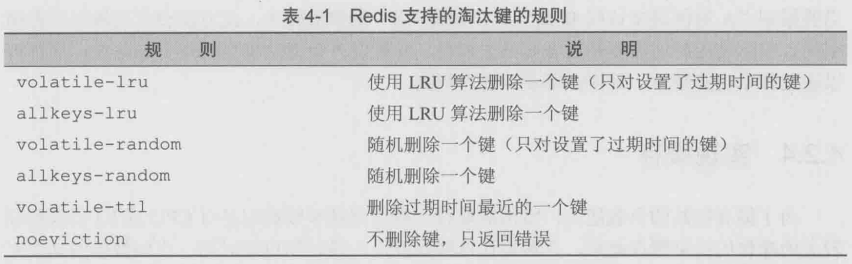

没过几天，小白就完成了博客的开发并将其部署上线。之后的一段 时间，小白又使用Redis开发了几个程序，用得还算顺手，
便没有继续 向宋老师请教Redis的更多知识。直到一个月后的一天，宋老师偶然访 问了小白的博客......

本章将会带领读者继续探索Redis，了解Redis的事务、排序与管道 等功能，并且还会详细地介绍如何优化Redis的存储空间。

# 事务

傍晚时候，忙完了一天的教学工作，宋老师坐在办公室的电脑前开 始为明天的课程做准备。尽管有着近5年的教学经验，可是宋老师依然 习惯在备课时写一份简单的教案。正在网上查找资料时，在浏览器的历 史记录里他突然看到了小白的博客。心想:不知道他的博客怎么样了?

于是宋老师点进了小白的博客，页面刚载入完他就被博客最下面的 一行大得夸张的文字吸引了:“Powered by Redis”。宋老师笑了笑，接着 就看到了小白博客中最新的一篇文章:

>标题:使用Redis来存储微博中的用户关系
> 
>正文:在微博中，用户之间是“关注”和“被关注”的关系。如果要使 用Redis存储这样的关系可以使用集合类型。思路是对每个用户使用两 个集合类型键，分别名为“user:用户ID:followers”和“user:用户 ID:following”，用来存储关注该用户的用户集合和该用户关注的用户集 合。
>
> def follow($currentUser, $targetUser) 
> 
> &ensp;&ensp;&ensp;&ensp;&ensp;&ensp;&ensp;&ensp;  SADD user:$currentUser:following, $targetUser 
> 
> &ensp;&ensp;&ensp;&ensp;&ensp;&ensp;&ensp;&ensp; SADD user:$targetUser:followers, $currentUser 
> 
> 如ID 为1的用户A 想关注ID 为2的用户B，只需要执行 follow(1, 2) 即可。然而在实现该功能的时候我发现了一个问题:完成关注操作需要 依次执行两条Redis命令，如果在第一条命令执行完后因为某种原因导 致第二条命令没有执行，就会出现一个奇怪的现象:A查看自己关注的 用户列表时会发现其中有B，而B查看关注自己的用户列表时却没有A， 换句话说就是，A虽然关注了B，却不是B的“粉丝”。真糟糕， A和B都 会对这个网站失望的!但愿不会出现这种情况。

宋老师看到此处，笑得合不拢嘴，把备课的事抛到了脑后。心 想:“看来有必要给小白传授一些进阶的知识。”他给小白写了封电子邮 件:

其实可以使用Redis的事务来解决这一问题。

## 概述

Redis中的事务(transaction)是一组命令的集合。事务同命令一样 都是 Redis 的最小执行单位，一个事务中的命令要么都执行，要么都不
执行。事务的应用非常普遍，如银行转账过程中A给B汇款，首先系统 从A的账户中将钱划走，然后向B的账户增加相应的金额。这两个步骤 必须属于同一个事务，要么全执行，要么全不执行。否则只执行第一 步，钱就凭空消失了，这显然让人无法接受。

事务的原理是先将属于一个事务的命令发送给Redis，然后再让 Redis依次执行这些命令。例如:

```
redis> MULTI
OK

redis> SADD "user:1:following" 2
QUEUED

redis> SADD "user:2:followers" 1
QUEUED

redis> EXEC
1) (integer) 1
2) (integer) 1
``` 

上面的代码演示了事务的使用方式。首先使用MULTI命令告诉
Redis:“下面我发给你的命令属于同一个事务，你先不要执行，而是把 它们暂时存起来。”Redis回答:“OK。”
   
而后我们发送了两个 SADD命令来实现关注和被关注操作，可以看 到 Redis 遵守了承诺，没有执行这些命令，而是返回QUEUED表示这两 条命令已经进入等待执行的事务队列中了。

当把所有要在同一个事务中执行的命令都发给 Redis 后，我们使用 EXEC 命令告诉Redis将等待执行的事务队列中的所有命令(即刚才所有 返回QUEUED的命令)按照发送顺序依次执行。EXEC 命令的返回值就 是这些命令的返回值组成的列表，返回值顺序和命令的顺序相同。

Redis保证一个事务中的所有命令要么都执行，要么都不执行。如 果在发送EXEC命令前客户端断线了，则 Redis 会清空事务队列，事务 中的所有命令都不会执行。而一旦客户端发送了EXEC命令，所有的命 令就都会被执行，即使此后客户端断线也没关系，因为Redis中已经记 录了所有要执行的命令。

除此之外，Redis 的事务还能保证一个事务内的命令依次执行而不 被其他命令插入。试想客户端A需要执行几条命令，同时客户端B发送 了一条命令，如果不使用事务，则客户端B的命令可能会插入到客户端 A的几条命令中执行。如果不希望发生这种情况，也可以使用事务。

## 错误处理

有些读者会有疑问，如果一个事务中的某个命令执行出错，Redis 会怎样处理呢?要回答这个问题，首先需要知道什么原因会导致命令执 行出错。

(1)语法错误。语法错误指命令不存在或者命令参数的个数不 对。比如:

```
redis> MULTI
OK

redis> SET key value 
QUEUED

redis> SET key
(error) ERR wrong number of arguments for 'set' command

redis> ERRORCOMMAND key
(error) ERR unknown command 'ERRORCOMMAND'

redis> EXEC
(error) EXECABORT Transaction discarded because of previous errors. 
```

跟在MULTI命令后执行了3个命令:一个是正确的命令，成功地加
入事务队列;其余两个命令都有语法错误。而只要有一个命令有语法错 误，执行 EXEC 命令后 Redis 就会直接返回错误，连语法正确的命令也 不会执行。


> 版本差异 Redis 2.6.5 之前的版本会忽略有语法错误的命令，然后执 行事务中其他语法正确的命令。就此例而言，SET key value会被执行， EXEC命令会返回一个结果:
> 
> 1)OK


(2) 运行错误。运行错误指在命令执行时出现的错误，比如使用 散列类型的命令操作集合类型的键，这种错误在实际执行之前 Redis 是 无法发现的，所以在事务里这样的命令是会被 Redis 接受并执行的。如 果事务里的一条命令出现了运行错误，事务里其他的命令依然会继续执 行(包括出错命令之后的命令)，示例如下:

```
redis> MULTI 
OK

redis> SET key 1 
QUEUED

redis> SADD key 2 
QUEUED

redis> SET key 3 
QUEUED

redis> EXEC
1) OK
2) (error) WRONGTYPE Operation against a key holding the wrong kind of value
3) OK

redis> GET key
"3"
```

可见虽然 SADD key 2出现了错误，但是 SET key 3依然执行了。 

Redis的事务没有关系数据库事务提供的回滚(rollback)[1] 功能。
为此开发者必须在事务执行出错后自己收拾剩下的摊子(将数据库复原
回事务执行前的状态等)。

不过由于 Redis 不支持回滚功能，也使得 Redis 在事务上可以保持 简洁和快速。另外回顾刚才提到的会导致事务执行失败的两种错误，其 中语法错误完全可以在开发时找出并解决，另外如果能够很好地规划数 据库(保证键名规范等)的使用，是不会出现如命令与数据类型不匹配 这样的运行错误的。


## WATCH命令介绍

我们已经知道在一个事务中只有当所有命令都依次执行完后才能得 到每个结果的返回值，可是有些情况下需要先获得一条命令的返回值， 然后再根据这个值执行下一条命令。例如介绍INCR命令时曾经说过使 用GET和SET命令自己实现incr函数会出现竞态条件，伪代码如下:

```
def incr($key)
    $value = GET $key
    if not $value 
        $value = 0
    $value = $value + 1 
    SET $key, $value 
    return $value
```

肯定会有很多读者想到可以用事务来实现incr函数以防止竞态条 件，可是因为事务中的每个命令的执行结果都是最后一起返回的，所以 无法将前一条命令的结果作为下一条命令的参数，即在执行SET命令时 无法获得GET命令的返回值，也就无法做到增1的功能了。

为了解决这个问题，我们需要换一种思路。即在GET获得键值后保 证该键值不被其他客户端修改，直到函数执行完成后才允许其他客户端 修改该键键值，这样也可以防止竞态条件。要实现这一思路需要请出事 务家族的另一位成员:WATCH。WATCH 命令可以监控一个或多个
键，一旦其中有一个键被修改(或删除)，之后的事务就不会执行。监 控一直持续到 EXEC 命令(事务中的命令是在 EXEC 之后才执行的， 所以在 MULTI 命令后可以修改WATCH监控的键值)，如:
```
redis> SET key 1 
OK

redis> WATCH key 
OK

redis> SET key 2 
OK

redis> MULTI 
OK

redis> SET key 3 
QUEUED

redis> EXEC 
(nil)

redis> GET key
"2"
```
上例中在执行 WATCH命令后、事务执行前修改了key的值(即
SET key 2)，所以最后事务中的命令 SET key 3没有执行，EXEC命令 返回空结果。

学会了WATCH命令就可以通过事务自己实现incr函数了，伪代码 如下:
```
def incr($key) 
    WATCH $key
    $value = GET $key 
    if not $value 
        $value = 0
    $value = $value + 1 
    MULTI
    SET $key, $value 
    result = EXEC 
    return result[0]
```

因为EXEC命令返回值是多行字符串类型，所以代码中使用result[0] 来获得其中第一个结果。

> 提示 由于WATCH命令的作用只是当被监控的键值被修改后阻止之 后一个事务的执行，而不能保证其他客户端不修改这一键值，所以我们 需要在EXEC执行失败后重新执行整个函数。

执行 EXEC 命令后会取消对所有键的监控，如果不想执行事务中的 命令也可以使用UNWATCH命令来取消监控。比如，我们要实现hsetxx 函数，作用与HSETNX命令类似，只不过是仅当字段存在时才赋值。为 了避免竞态条件我们使用事务来完成这一功能:
```
def hsetxx($key, $field, $value) 
    WATCH $key
    $isFieldExists = HEXISTS $key, $field 
    if $isFieldExists is 1
        MULTI
        HSET $key, $field, $value
        EXEC
    else
        UNWATCH
    return $isFieldExists
```
在代码中会判断要赋值的字段是否存在，如果字段不存在的话就不 执行事务中的命令，但需要使用UNWATCH命令来保证下一个事务的执 行不会受到影响。


# 过期时间

转天早上宋老师就收到了小白的回信，内容基本上都是一些表示感
谢的话。宋老师又看了一下小白发的那篇文章，发现他已经在文末补充
了使用事务来解决竞态条件的方法。

宋老师单击了评论链接想发表评论，却看到博客出现了错误“请求 超时”(Request timeout)。宋老师疑惑了一下，准备稍后再访问看看， 就接着忙别的事情了。

没过一会儿，宋老师就收到了一封小白发来的邮件:

宋老师您好!我的博客最近经常无法访问，我看了日志后发现是因 为某个搜索引擎爬虫访问得太频繁，加上本来我的服务器性能就不太 好，很容易资源就被占满了。请问有没有方法可以限定每个IP地址每分 钟最大的访问次数呢?

宋老师这才明白为什么刚才小白的博客请求超时了，于是放下了手 头的事情开始继续给小白介绍Redis的更多功能... ...

## 命令介绍

在实际的开发中经常会遇到一些有时效的数据，比如限时优惠活 动、缓存或验证码等，过了一定的时间就需要删除这些数据。在关系数 据库中一般需要额外的一个字段记录到期时间，然后定期检测删除过期 数据。而在Redis中可以使用 EXPIRE命令设置一个键的过期时间，到时 间后Redis会自动删除它。

EXPIRE 命令的使用方法为 EXPIRE key seconds，其中 seconds 参 数表示键的过期时间，单位是秒。如要想让session:29e3d键在15分钟后 被删除:
```
redis> SET session:29e3d uid1314
OK
redis> EXPIRE session:29e3d 900
(integer) 1 
```

EXPIRE命令返回1表示设置成功，返回0则表示键不存在或设置失
败。例如:

```
redis> DEL session:29e3d 
(integer) 1

redis> EXPIRE session:29e3d 900
(integer) 0 
```

如果想知道一个键还有多久的时间会被删除，可以使用TTL命令。
返回值是键的剩余时间(单位是秒):
```
redis> SET foo bar OK

redis> EXPIRE foo 20 
(integer) 1

redis> TTL foo
(integer) 15

redis> TTL foo
(integer) 7

redis> TTL foo
(integer) –2 
```

可见随着时间的不同，foo键的过期时间逐渐减少，20秒后foo键会
被删除。当键不存在时TTL命令会返回−2。 

那么没有为键设置过期时间(即永久存在，这是建立一个键后的默
认情况)的情况下会返回什么呢?答案是返回−1: 

```
redis> SET persistKey value
OK
redis> TTL persistKey
(integer) –1
```

> 版本差异 在2.6版中，无论键不存在还是键没有过期时间都会返回 −1，直到2.8版后两种情况才会分别返回−2和−1两种结果。


如果想取消键的过期时间设置(即将键恢复成永久的)，则可以使 用PERSIST命令。如果过期时间被成功清除则返回1;否则返回0(因为 键不存在或键本来就是永久的):

```
redis> SET foo bar OK

redis> EXPIRE foo 20 
(integer) 1

redis> PERSIST foo
(integer) 1

redis> TTL foo
(integer) –1 
```

除了PERSIST命令之外，使用SET或GETSET命令为键赋值也会同
时清除键的过期时间，例如:
```
redis> EXPIRE foo 20 
(integer) 1
redis> SET foo bar OK
redis> TTL foo
(integer) –1 
```

使用EXPIRE命令会重新设置键的过期时间，就像这样: 
```
redis> SET foo bar
OK
redis> EXPIRE foo 20
(integer) 1
redis> TTL foo
(integer) 15
redis> EXPIRE foo 20
(integer) 1
redis> TTL foo
(integer) 17 
```

其他只对键值进行操作的命令(如INCR、LPUSH、HSET、 ZREM)均不会影响键的过期时间。 

EXPIRE命令的seconds参数必须是整数，所以最小单位是1秒。如果
想要更精确的控制键的过期时间应该使用 PEXPIRE命令，PEXPIRE命 令与 EXPIRE的唯一区别是前者的时间单位是毫秒，即 PEXPIRE key 1000 与 EXPIRE key 1 等价。对应地可以用 PTTL命令以毫秒为单位返 回键的剩余时间。

> 提示 如果使用 WATCH命令监测了一个拥有过期时间的键，该键时 间到期自动删除并不会被WATCH命令认为该键被改变。

另外还有两个相对不太常用的命令:EXPIREAT和PEXPIREAT。

EXPIREAT命令与EXPIRE命令的差别在于前者使用Unix时间作为 第二个参数表示键的过期时刻。PEXPIREAT命令与EXPIREAT命令的 区别是前者的时间单位是毫秒。如:
```
redis> SET foo bar
OK

redis> EXPIREAT foo 1351858600 
(integer) 1

redis> TTL foo
(integer) 142

redis> PEXPIREAT foo 1351858700000
(integer) 1
```

## 实现访问频率限制之一

回到小白的问题，为了减轻服务器的压力，需要限制每个用户(以 IP计)一段时间的最大访问量。与时间有关的操作很容易想到EXPIRE 命令。

例如要限制每分钟每个用户最多只能访问100个页面，思路是对每 个用户使用一个名为 rate.limiting:用户 IP的字符串类型键，每次用户访 问则使用 INCR命令递增该键的键值，如果递增后的值是1(第一次访问 页面)，则同时还要设置该键的过期时间为1分钟。这样每次用户访问 页面时都读取该键的键值，如果超过了100就表明该用户的访问频率超 过了限制，需要提示用户稍后访问。该键每分钟会自动被删除，所以下 一分钟用户的访问次数又会重新计算，也就达到了限制访问频率的目 的。

上述流程的伪代码如下:
```
$isKeyExists = EXISTS rate.limiting:$IP 
if $isKeyExists is 1
    $times = INCR rate.limiting:$IP
    if $times > 100
        print 访问频率超过了限制，请稍后再试。 
        exit
else
    INCR rate.limiting:$IP 
    EXPIRE $keyName, 60
```
这段代码存在一个不太明显的问题:假如程序执行完倒数第二行后 突然因为某种原因退出了，没能够为该键设置过期时间，那么该键会永 久存在，导致使用对应的IP的用户在管理员手动删除该键前最多只能访 问100次博客，这是一个很严重的问题。

为了保证建立键和为键设置过期时间一起执行，可以使用上节学习
的事务功能，修改后的代码如下:
```
$isKeyExists = EXISTS rate.limiting:$IP 
if $isKeyExists is 1
    $times = INCR rate.limiting:$IP
    if $times > 100
        print 访问频率超过了限制，请稍后再试。 exit
else
    MULTI
    INCR rate.limiting:$IP 
    EXPIRE $keyName, 60 
    EXEC
```

## 实现访问频率限制之二
事实上，4.2.2节中的代码仍然有个问题:如果一个用户在一分钟的 第一秒访问了一次博客，在同一分钟的最后一秒访问了9次，又在下一 分钟的第一秒访问了10次，这样的访问是可以通过现在的访问频率限制 的，但实际上该用户在2秒内访问了19次博客，这与每个用户每分钟只 能访问10次的限制差距较大。尽管这种情况比较极端，但是在一些场合 中还是需要粒度更小的控制方案。如果要精确地保证每分钟最多访问10 次，需要记录下用户每次访问的时间。因此对每个用户，我们使用一个 列表类型的键来记录他最近10次访问博客的时间。一旦键中的元素超过 10 个，就判断时间最早的元素距现在的时间是否小于 1分钟。如果是则 表示用户最近1分钟的访问次数超过了10次;如果不是就将现在的时间 加入到列表中，同时把最早的元素删除。

上述流程的伪代码如下:

```
$listLength = LLEN rate.limiting:$IP 
if $listLength < 10
    LPUSH rate.limiting:$IP, now() 
else
    $time = LINDEX rate.limiting:$IP, -1
    if now() - $time < 60
        print 访问频率超过了限制，请稍后再试。 
    else
    
        LPUSH rate.limiting:$IP, now()
        LTRIM rate.limiting:$IP, 0, 9
```

代码中 now()的功能是获得当前的 Unix 时间。由于需要记录每次访 问的时间，所以当要限制“A时间最多访问B次”时，如果“B”的数值较 大，此方法会占用较多的存储空间，实际使用时还需要开发者自己去权 衡。除此之外该方法也会出现竞态条件，同样可以通过脚本功能避免， 具体在第6章会介绍到。

## 实现缓存

为了提高网站的负载能力，常常需要将一些访问频率较高但是对
CPU或IO资源消耗较大的操作的结果缓存起来，并希望让这些缓存过一
段时间自动过期。比如教务网站要对全校所有学生的各个科目的成绩汇
总排名，并在首页上显示前10名的学生姓名，由于计算过程较耗资源，
所以可以将结果使用一个 Redis 的字符串键缓存起来。由于学生成绩总
在不断地变化，需要每隔两个小时就重新计算一次排名，这可以通过给
键设置过期时间的方式实现。每次用户访问首页时程序先查询缓存键是
否存在，如果存在则直接使用缓存的值；否则重新计算排名并将计算结
果赋值给该键并同时设置该键的过期时间为两个小时。伪代码如下：

```
$rank = GET cache:rank
if not $rank
    $rank = 计算排名...
    MUlTI
    SET cache:rank, $rank
    EXPIRE cache:rank, 7200
    EXEC
```

然而在一些场合中这种方法并不能满足需要。当服务器内存有限
时，如果大量地使用缓存键且过期时间设置得过长就会导致 Redis 占满
内存；另一方面如果为了防止 Redis 占用内存过大而将缓存键的过期时
间设得太短，就可能导致缓存命中率过低并且大量内存白白地闲置。实
际开发中会发现很难为缓存键设置合理的过期时间，为此可以限制
Redis 能够使用的最大内存，并让Redis按照一定的规则淘汰不需要的缓
存键，这种方式在只将Redis用作缓存系统时非常实用。

具体的设置方法为：修改配置文件的maxmemory参数，限制Redis
最大可用内存大小（单位是字节），当超出了这个限制时Redis会依据
maxmemory-policy参数指定的策略来删除不需要的键直到Redis占用的内
存小于指定内存。

maxmemory-policy支持的规则如表4-1所示。其中的LRU（Least
Recently Used）算法即“最近最少使用”，其认为最近最少使用的键在未
来一段时间内也不会被用到，即当需要空间时这些键是可以被删除的。



如当maxmemory-policy设置为allkeys-lru时，一旦Redis占用的内存
超过了限制值，Redis会不断地删除数据库中最近最少使用的键[2] ，直到
占用的内存小于限制值。

# 排序

午后，宋老师正在批改学生们提交的程序，再过几天就会迎来第一
次计算机全市联考。他在每个学生的程序代码末尾都用注释详细地做了批注——严谨的治学态度让他备受学生们的爱戴。

一个电话打来。“小白的？”宋老师拿出手机，“博客最近怎么样
了？”未及小白开口，他就抢先问道。

“特别好！现在平均每天都有50多人访问我的博客。不过昨天我收
到一个访客的邮件，他向我反映了一个问题：查看一个标签下的文章列
表时文章不是按照时间顺序排列的，找起来很麻烦。我看了一下代码，
发现程序中是使用SMEMBERS命令获取标签下的文章列表，因为集合
类型是无序的，所以不能实现按照文章的发布时间排列。我考虑过使用
有序集合类型存储标签，但是有序集合类型的集合操作不如集合类型强
大。您有什么好方法来解决这个问题吗？

方法有很多，我推荐使用 SORT 命令，你先挂了电话，我写好后发
邮件给你吧。

## 有序集合的集合操作

集合类型提供了强大的集合操作命令，但是如果需要排序就要用到
有序集合类型。Redis的作者在设计Redis的命令时考虑到了不同数据类
型的使用场景，对于不常用到的或者在不损失过多性能的前提下可以使
用现有命令来实现的功能，Redis就不会单独提供命令来实现。这一原
则使得Redis在拥有强大功能的同时保持着相对精简的命令。

有序集合常见的使用场景是大数据排序，如游戏的玩家排行榜，所
以很少会需要获得键中的全部数据。同样 Redis 认为开发者在做完交
集、并集运算后不需要直接获得全部结果，而是会希望将结果存入新的
键中以便后续处理。这解释了为什么有序集合只有ZINTERSTORE和
ZUNIONSTORE命令而没有ZINTER和ZUNION命令。

当然实际使用中确实会遇到像小白那样需要直接获得集合运算结果
的情况，除了等待Redis 加入相关命令，我们还可以使用 MULTI,
ZINTERSTORE, ZRANGE, DEL和 EXEC这5个命令自己实现ZINTER：
```
MULTI
ZINTERSTORE tempKey ...
ZRANGE tempKey ...
DEL tempKey
EXEC
```

## SORT命令

除了使用有序集合外，我们还可以借助 Redis 提供的 SORT命令来
解决小白的问题。SORT命令可以对列表类型、集合类型和有序集合类
型键进行排序，并且可以完成与关系数据库中的连接查询相类似的任
务。

小白的博客中标有“ruby”标签的文章的ID分别
是“2”、“6”、“12”和“26”。由于在集合类型中所有元素是无序的，所以
使用SMEMBERS命令并不能获得有序的结果[3] 。为了能够让博客的标签
页面下的文章也能按照发布的时间顺序排列（如果不考虑发布后再修改
文章发布时间，就是按照文章ID的顺序排列），可以借助SORT命令实
现，方法如下所示：
```
redis> SORT tag:ruby:posts
1) "2"
2) "6"
3) "12"
4) "26"
```

是不是十分简单？除了集合类型，SORT 命令还可以对列表类型和
有序集合类型进行排序：

```
redis> LPUSH mylist 4 2 6 1 3 7
(integer) 6
redis> SORT mylist
1) "1"
2) "2"
3) "3"
4) "4"
5) "6"
6) "7"
```

在对有序集合类型排序时会忽略元素的分数，只针对元素自身的值
进行排序。比如：
```
redis> ZADD myzset 50 2 40 3 20 1 60 5
(integer) 4
redis> SORT myzset
1) "1"
2) "2"
3) "3"
4) "5"
```

除了可以排列数字外，SORT命令还可以通过ALPHA参数实现按照
字典顺序排列非数字元素，就像这样：

```
redis> LPUSH mylistalpha a c e d B C A
(integer) 7
redis> SORT mylistalpha
(error) ERR One or more scores can't be converted into double
redis> SORT mylistalpha ALPHA
1) "A"
2) "B"
3) "C"
4) "a"
5) "c"
6) "d"
7) "e"
```

从这段示例中可以看到如果没有加ALPHA参数的话，SORT命令会
尝试将所有元素转换成双精度浮点数来比较，如果无法转换则会提示错
误。

回到小白的问题，SORT 命令默认是按照从小到大的顺序排列，而
一般博客中显示文章的顺序都是按照时间倒序的，即最新的文章显示在
最前面。SORT命令的DESC参数可以实现将元素按照从大到小的顺序排
列：
```
redis> SORT tag:ruby:posts DESC
1) "26"
2) "12"
3) "6"
4) "2"
```

那么如果文章数量过多需要分页显示呢？SORT命令还支持LIMIT
参数来返回指定范围的结果。用法和 SQL 语句一样，LIMIT offset
count，表示跳过前 offset 个元素并获取之后的count个元素。

SORT命令的参数可以组合使用，像这样：
```
redis> SORT tag:ruby:posts DESC LIMIT 1 2
1) "12"
2) "6"
```

## BY参数

很多情况下列表（或集合、有序集合）中存储的元素值代表的是对
象的ID（如标签集合中存储的是文章对象的ID），单纯对这些ID自身排
序有时意义并不大。更多的时候我们希望根据ID对应的对象的某个属性
进行排序。回想3.6节，我们通过使用有序集合键来存储文章ID列表，
使得小白的博客能够支持修改文章时间，所以文章ID的顺序和文章的发
布时间的顺序并不完全一致，因此4.3.2节介绍的对文章ID本身排序就变
得没有意义了。
小白的博客是使用散列类型键存储文章对象的，其中time字段存储
的就是文章的发布时间。现在我们知道ID为“2”、“6”、“12”和“26”的四
篇文章的time字段的值分别
为“1352619200”、“1352619600”、“1352620100”和“1352620000”（Unix
时间）。如果要按照文章的发布时间递减排列结果应
为“12”、“26”、“6”和“2”。为了获得这样的结果，需要使用SORT命令的
另一个强大的参数：BY。

BY参数的语法为BY参考键。其中参考键可以是字符串类型键或者
是散列类型键的某个字段（表示为键名->字段名）。如果提供了 BY 参
数，SORT 命令将不再依据元素自身的值进行排序，而是对每个元素使
用元素的值替换参考键中的第一个“*”并获取其值，然后依据该值对元
素排序。就像这样：

```
redis> SORT tag:ruby:posts BY post:*->time DESC
1) "12"
2) "26"
3) "6"
4) "2"
```

在上例中SORT命令会读取post:2、post:6、post:12、post:26几个散
列键中的time字段的值并以此决定tag:ruby:posts键中各个文章ID的顺
序。

除了散列类型之外，参考键还可以是字符串类型，比如：

```
redis> LPUSH sortbylist 2 1 3
(integer) 3
redis> SET itemscore:1 50
OK
redis> SET itemscore:2 100
OK
redis> SET itemscore:3 -10
OK
redis> SORT sortbylist BY itemscore:* DESC
1) "2"
2) "1"
3) "3"
```

当参考键名不包含“*”时（即常量键名，与元素值无关），SORT 命
令将不会执行排序操作，因为Redis认为这种情况是没有意义的（因为
所有要比较的值都一样）。例如：

```
redis> SORT sortbylist BY anytext
1) "3"
2) "1"
3) "2"
```

例子中 anytext 是常量键名（甚至 anytext 键可以不存在），此时
SORT 的结果与LRANGE的结果相同，没有执行排序操作。在不需要排
序但需要借助SORT命令获得与元素相关联的数据时（见4.3.4节），常
量键名是很有用的。

如果几个元素的参考键值相同，则 SORT 命令会再比较元素本身的
值来决定元素的顺序。像这样：
```
redis> LPUSH sortbylist 4
(integer) 4
redis> SET itemscore:4 50
OK
redis> SORT sortbylist BY itemscore:* DESC
1) "2"
2) "4"
3) "1"
4) "3"
```

示例中元素"4"的参考键itemscore:4的值和元素"1"的参考键
itemscore:1的值都是50，所以SORT命令会再比较"4"和"1"元素本身的大
小来决定二者的顺序。

当某个元素的参考键不存在时，会默认参考键的值为0：
```
redis> LPUSH sortbylist 5
(integer) 5
redis> SORT sortbylist BY itemscore:* DESC
1) "2"
2) "4"
3) "1"
4) "5"
5) "3"
```

上例中"5"排在了"3"的前面，是因为"5"的参考键不存在，所以默认
为 0，而"3"的参考键值为−10。

补充知识 参考键虽然支持散列类型，但是*只能在“->”符号前面
（即键名部分）才有用，在“->”后（即字段名部分）会被当成字段名本
身而不会作为占位符被元素的值替换，即常量键名。但是实际运行时会
发现一个有趣的结果：

```
redis> SORT sortbylist BY somekey->somefield:*
1) "1"
2) "2"
3) "3"
4) "4"
5) "5"
```

上面提到了当参考键名是常量键名时 SORT 命令将不会执行排序操
作，然而上例中确进行了排序，而且只是对元素本身进行排序。这是因
为 Redis 判断参考键名是不是常量键名的方式是判断参考键名中是否包
含*，而 somekey->somefield:*中包含 *所以不是常量键名。所以在排
序的时候Redis对每个元素都会读取键somekey中的 somefield:*字段
（ *不会被替换），无论能否获得其值，每个元素的参考键值是相同
的，所以Redis会按照元素本身的大小排列。

## GET参数

现在小白的博客已经可以按照文章的发布顺序获得一个标签下的文
章 ID 列表了，接下来要做的事就是对每个ID都使用HGET命令获取文
章的标题以显示在博客列表页中。有没有觉得很麻烦？不论你的答案如
何，都有一种更简单的方式来完成这个操作，那就是借助SORT命令的
GET参数。

GET参数不影响排序，它的作用是使 SORT命令的返回结果不再是
元素自身的值，而是GET参数中指定的键值。GET参数的规则和BY参
数一样，GET参数也支持字符串类型和散列类型的键，并使用“*”作为
占位符。要实现在排序后直接返回ID对应的文章标题，可以这样写：
```
redis> SORT tag:ruby:posts BY post:*->time DESC GET post:*->title
1) "Windows 8 app designs"
2) "RethinkDB - An open-source distributed database built with love"
3) "Uses for cURL"
4) "The Nature of Ruby"
```

在一个SORT命令中可以有多个GET参数（而BY参数只能有一
个），所以还可以这样用：
```
redis> SORT tag:ruby:posts BY post:*->time DESC GET post:*->title GET post:*->time
1) "Windows 8 app designs"
2) "1352620100"
4) "1352620000"
3) "RethinkDB - An open-source distributed database built with love"
4) "1352620000"
5) "Uses for cURL"
6) "1352619600"
7) "The Nature of Ruby"
8) "1352619200"
```

可见有N个GET参数，每个元素返回的结果就有N行。这时有个问
题：如果还需要返回文章ID 该怎么办？答案是使用 GET #。就像这
样：

```
redis> SORT tag:ruby:posts BY post:*->time DESC GET post:*->title GET post:*->time GET #
1) "Windows 8 app designs"
2) "1352620100"
3) "12"
4) "RethinkDB - An open-source distributed database built with love"
5) "1352620000"
6) "26"
7) "Uses for cURL"
8) "1352619600"
9) "6"
10) "The Nature of Ruby"
11) "1352619200"
12) "2"
```
    
也就是说，GET #会返回元素本身的值。


## STORE参数

默认情况下SORT会直接返回排序结果，如果希望保存排序结果，
可以使用STORE参数。如希望把结果保存到sort.result键中：

```
redis> SORT tag:ruby:posts BY post:*->time DESC GET post:*->title GET post:*->time GET # STORE sort.result
(integer) 12

redis> LRANGE sort.result 0 -1
1) "Windows 8 app designs"
2) "1352620100"
3) "12"
4) "RethinkDB - An open-source distributed database built with love"
5) "1352620000"
6) "26"
7) "Uses for cURL"
8) "1352619600"
9) "6"
10) "The Nature of Ruby"
11) "1352619200"
12) "2"
```

保存后的键的类型为列表类型，如果键已经存在则会覆盖它。加上
STORE参数后SORT命令的返回值为结果的个数。

STORE参数常用来结合EXPIRE命令缓存排序结果，如下面的伪代
码：

```
# 判断是否存在之前排序结果的缓存
$isCacheExists = EXISTS cache.sort
if $isCacheExists is 1
    # 如果存在则直接返回
    return LRANGE cache.sort, 0, -1
else
    # 如果不存在，则使用 SORT命令排序并将结果存入 cache.sort
    键中作为缓存
    $sortResult = SORT some.list STORE cache.sort
    # 设置缓存的过期时间为 10分钟
    EXPIRE cache.sort, 600
    # 返回排序结果
    return $sortResult
```

## 性能优化
SORT是Redis中最强大最复杂的命令之一，如果使用不好很容易成
为性能瓶颈。SORT命令的时间复杂度是O(n+mlog(m))，其中n表示要排
序的列表（集合或有序集合）中的元素个数，m表示要返回的元素个
数。当n较大的时候SORT命令的性能相对较低，并且Redis在排序前会
建立一个长度为n
[4] 的容器来存储待排序的元素，虽然是一个临时的过
程，但如果同时进行较多的大数据量排序操作则会严重影响性能。

所以开发中使用SORT命令时需要注意以下几点。

（1）尽可能减少待排序键中元素的数量（使N尽可能小）。

（2）使用LIMIT参数只获取需要的数据（使M尽可能小）。

（3）如果要排序的数据数量较大，尽可能使用STORE参数将结果
缓存。

# 消息通知


# 管道


# 节省空间


